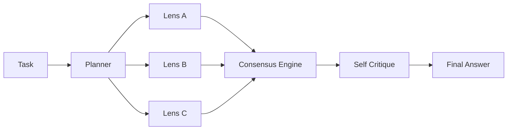
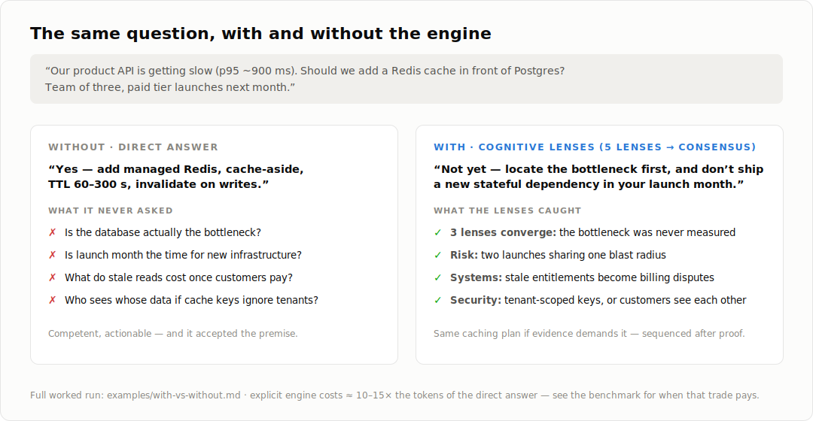
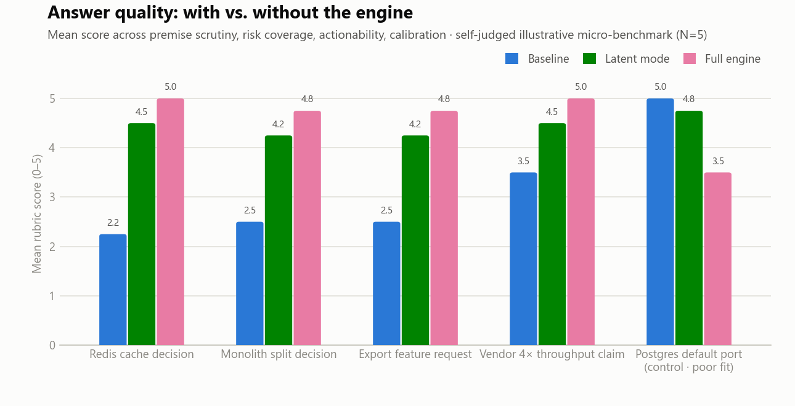
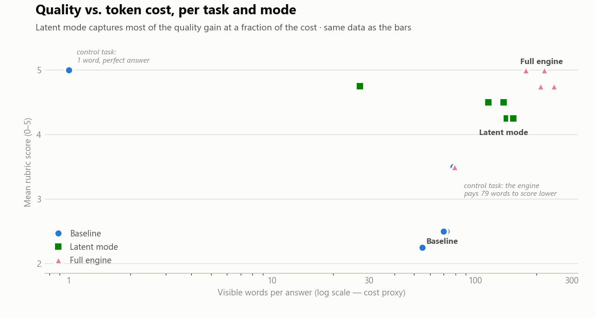
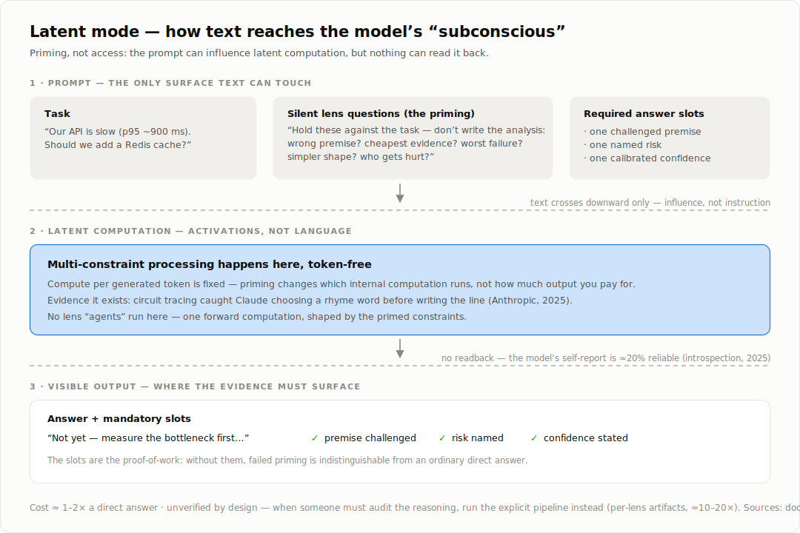

# Cognitive Lenses

**You know the moment.** You ask an AI to build you a game. It delivers, proudly announcing the result is *"AAA quality"* — you run it, and it's junk. The failure isn't a lack of knowledge. It's a lack of the habits of mind that human experts have: no self-criticism before declaring victory, no second perspective asking *what's actually broken here?*, no connection between the confidence in the words and the evidence on the screen.

Cognitive Lenses exists to install those habits. A multi-perspective reasoning framework for AI agents, packaged as a portable, model-agnostic skill — the answer only ships after other ways of thinking have attacked it, and the stated confidence has to survive a calibration check it can fail.

Each **lens** is a specific cognitive strategy or reasoning heuristic — divergent thinking, skeptical analysis, risk scanning, adversarial security thinking, systems thinking, empathy, and more. Not personas, not simulated people: strategies. A task is analyzed by several lenses independently, their observations are merged by a consensus engine, and the result passes a final self-critique before the answer ships.



## Why

A single-pass LLM answer tends to accept the premise of the question and answer from one implicit viewpoint. The interesting failures — the unmeasured bottleneck, the launch-week blast radius, the customer the feature harms, the cache key that leaks tenant data — live in the viewpoints the single pass never took. Forcing several fixed, independent question sets over the same task surfaces them, and forcing the merge step to keep disagreements visible stops the ensemble from averaging them away.



The full run behind this panel is in [examples/with-vs-without.md](examples/with-vs-without.md), reproduced answer by answer.

## Does it help? The benchmark

Five tasks, each answered three ways — direct answer, latent mode, full engine — and scored on premise scrutiny, risk coverage, actionability, and calibration. Every answer, score, and chart is regenerable from [benchmark/](benchmark/). **Read the [limitations](benchmark/README.md) before quoting numbers: N=5, self-judged, illustrative.**

<picture>
  <source media="(prefers-color-scheme: dark)" srcset="docs/img/benchmark-scores-dark.png">
  
</picture>

On good-fit tasks the engine roughly doubles the baseline's rubric score (≈2.7 → ≈4.9), with latent mode close behind (≈4.4) at a fraction of the cost. On the control task — a trivial factual question — the ranking inverts: the baseline's one-word answer beats the engine's twenty-line ritual. The framework's go/no-go gate is part of the framework.

<picture>
  <source media="(prefers-color-scheme: dark)" srcset="docs/img/benchmark-tradeoff-dark.png">
  
</picture>

## Latent mode: the lenses in the model's "subconscious"

The explicit pipeline buys auditability with tokens. **Latent mode** buys most of the quality for a fraction of the cost: the Planner still selects lenses, but their fixed questions are injected as silent constraints on a single generation pass — no per-lens transcripts, only mandatory answer slots (challenged premise, named risk, calibrated confidence) that force the primed thinking to surface as conclusions.



The design leans on three Anthropic research results, and inherits their limits:

- Models genuinely compute beyond what they emit — circuit tracing caught Claude planning rhymes before writing the line ([Tracing the thoughts of a large language model](https://www.anthropic.com/research/tracing-thoughts-language-model)). Latent multi-constraint processing is the mechanism latent mode leans on.
- Models can't reliably report their own internals — ~20% detection of injected concepts under optimal conditions ([Emergent introspective awareness](https://www.anthropic.com/research/introspection)). So "yes, I applied the lenses internally" is not evidence, and latent mode never claims it is.
- Even visible reasoning is not a faithful trace ([Reasoning models don't always say what they think](https://www.anthropic.com/research/reasoning-models-dont-say-think)). Explicit transcripts are *checkable artifacts*, not guaranteed introspection — which is exactly why they remain the mode of choice when someone must audit the answer.

Full design, prompts, and boundaries: [latent-mode.md](skills/cognitive-lenses/references/latent-mode.md). The complete annotated bibliography — these three plus the multi-agent reasoning literature (self-consistency, multiagent debate, Mixture-of-Agents, Tree of Thoughts) and the decision-science roots of each lens — is in [docs/research.md](docs/research.md).

## What's inside

| Path | What it is |
|---|---|
| [skills/cognitive-lenses/SKILL.md](skills/cognitive-lenses/SKILL.md) | The skill manifest: pipeline, effort tiers, weighting, independence rules |
| [references/lens-catalog.md](skills/cognitive-lenses/references/lens-catalog.md) | 14 built-in lenses, each with goal, strategy, fixed questions, cost, and **when NOT to use it** |
| [references/consensus-engine.md](skills/cognitive-lenses/references/consensus-engine.md) | Clustering, conflict resolution, confidence calibration, self-critique gate |
| [references/lens-selection.md](skills/cognitive-lenses/references/lens-selection.md) | Adaptive lens profiles per task type, with adjustment and cost rules |
| [references/custom-lenses.md](skills/cognitive-lenses/references/custom-lenses.md) | Template and best practices for community lenses, with worked examples |
| [references/latent-mode.md](skills/cognitive-lenses/references/latent-mode.md) | The low-token "subconscious" mode, grounded in Anthropic interpretability research |
| [examples/](examples/) | With-vs-without demo, good fits, poor fits |
| [benchmark/](benchmark/) | Tasks, three-mode answers, rubric, scores, and the chart renderer |
| [docs/research.md](docs/research.md) | Every source the design leans on — Anthropic interpretability, multi-agent reasoning papers, decision-science roots — annotated with which claim each supports or constrains |
| [tests/](tests/) | Structural tests that keep the catalog, profiles, benchmark, and templates consistent |

## Quick start

**Claude Code** — copy the skill into your project and invoke it:

```bash
cp -r skills/cognitive-lenses .claude/skills/
# then, in a session:
/cognitive-lenses Should we migrate our monolith to microservices?
```

**Any other LLM or agent framework** — the skill is plain markdown. Paste [SKILL.md](skills/cognitive-lenses/SKILL.md) plus [lens-catalog.md](skills/cognitive-lenses/references/lens-catalog.md) into the system prompt (or load them as tools/context), then submit the task. For agent frameworks with parallel sub-agents, run one lens per sub-agent; the independence rules in SKILL.md say how.

## When to use it — and when not to

The framework costs roughly 10–20× a direct answer. It earns that on decisions that are hard to reverse, span multiple dimensions, or hide a challengeable premise — and it actively hurts on syntax questions, emergencies, settled decisions, and matters of taste.

- ✅ [examples/good-fits.md](examples/good-fits.md) — architecture decisions, plan reviews, claim evaluation, postmortems, high-stakes writing
- ❌ [examples/poor-fits.md](examples/poor-fits.md) — including a full demonstration of the framework wasting twenty lines to answer "5432"

The Planner's first duty is deciding **whether** to run, not just which lenses to pick.

## Tests

```bash
python tests/test_skill_structure.py   # stdlib only
python tests/test_benchmark.py
# or
pytest
```

The tests enforce the framework's own contracts: every lens has all required fields (including "Do NOT use when"), selection profiles only reference lenses that exist, links resolve, and custom-lens examples follow the mandatory template.

## Extending

Add lenses by following the template in [custom-lenses.md](skills/cognitive-lenses/references/custom-lenses.md). The rules that matter: one strategy per lens, strategies not personas, honest cost declaration, and a real "Do NOT use when" — a lens applicable everywhere is a lens sharpened nowhere.

## License

[MIT](LICENSE)
